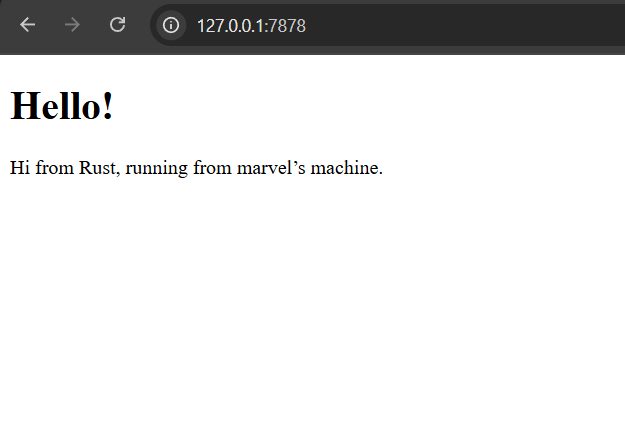
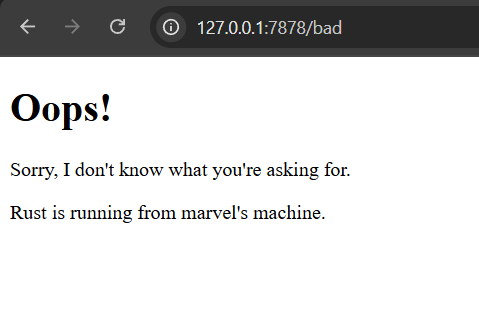

# Module06-Concurrency

## Commit 1 Reflection Notes

Dalam fungsi `handle_connection`, saya menggunakan `BufReader` untuk membaca data dari `TcpStream` secara efisien dan membaginya menjadi baris-baris teks. Poin krusial di sini adalah penggunaan `.take_while(|line| !line.is_empty())`, yang berfungsi untuk menangkap seluruh *HTTP header* dan berhenti tepat saat server menemui baris kosong yang menandakan akhir dari sebuah *HTTP request*. Proses ini memungkinkan saya untuk melihat bagaimana browser berkomunikasi secara mentah dengan server, mulai dari *Request Line* (seperti `GET / HTTP/1.1`) hingga berbagai informasi *headers* lainnya sebelum nantinya server dapat mengirimkan respons balik.

## Commit 2 Reflection Notes

Pada Milestone 2, saya belajar cara mengirimkan respons HTTP yang valid agar browser dapat menampilkan konten visual. Fungsi `handle_connection` kini tidak hanya membaca *request*, tetapi juga menyusun respons yang terdiri dari **status line** (`HTTP/1.1 200 OK`), **headers** (khususnya `Content-Length` untuk memberi tahu browser ukuran data yang dikirim), dan **response body** yang berisi konten file `hello.html`. Penggunaan `fs::read_to_string` memudahkan pemisahan logika kode Rust dengan konten HTML, sementara `stream.write_all` memastikan seluruh paket data tersebut terkirim kembali ke klien melalui koneksi TCP yang terbuka.

## Commit 3 Reflection Notes

Pada Milestone 3, Pak Ade ingin mengajarkan cara membangun mekanisme *routing* sederhana untuk memvalidasi *request path* dan memberikan respons yang sesuai, seperti mengembalikan halaman `404 Not Found` jika rute tidak dikenali. Selain logika percabangan, poin pembelajaran krusial di sini adalah pentingnya melakukan *refactoring*. Tanpa *refactoring*, blok `if-else` akan memunculkan banyak duplikasi kode untuk proses membaca file dan menyusun respons. Dengan melakukan *refactoring*, kita cukup membedakan deklarasi `status_line` dan nama file di dalam blok kondisi, lalu menyatukan eksekusi pembacaan file dan pengiriman data di akhir. Hal ini membuat struktur kode terhindar dari redundansi (menerapkan prinsip *Don't Repeat Yourself*), lebih bersih, dan lebih mudah dikembangkan ke depannya.

## Commit 4 Reflection Notes

Pada Milestone 4 ini, saya menguji kelemahan dari arsitektur *single-threaded web server* dengan menyimulasikan proses yang berjalan lambat. Saya menambahkan rute `/sleep` yang akan menghentikan sementara eksekusi *thread* selama kurang lebih 10 detik (`thread::sleep`). 

Dari eksperimen membuka dua jendela browser, saya mengamati bahwa:
1. Ketika saya mengakses rute `/sleep` terlebih dahulu, server sedang sibuk menunggu.
2. Jika saya mencoba mengakses halaman utama (`/`) di tab lain saat server masih memproses rute `/sleep`, halaman tersebut tidak akan langsung dimuat. Browser akan terus berputar (*loading*) sampai proses *sleep* selama 10 detik di tab pertama selesai.

Hal ini terjadi karena server memproses *request* secara sekuensial (satu per satu antrean). Ini membuktikan bahwa arsitektur *single-threaded* sangat tidak efisien untuk *web server* di dunia nyata, karena satu pengguna dengan koneksi lambat atau *request* berat dapat memblokir seluruh pengguna lain. Solusi untuk masalah ini adalah dengan mengimplementasikan *multi-threading* (seperti *Thread Pool*) agar server dapat menangani banyak *request* secara konkuren (*concurrently*).

## Commit 5 Reflection Notes

Pada Milestone 5 ini, saya telah berhasil mengubah server yang awalnya *single-threaded* menjadi *multithreaded* menggunakan **ThreadPool**. Hal ini menyelesaikan masalah *blocking* yang disimulasikan pada Milestone 4.

**Bagaimana ThreadPool bekerja:**
Daripada membuat *thread* baru secara tak terbatas (yang berisiko menghabiskan memori dan menjatuhkan server jika diserang jutaan *request*), *ThreadPool* menentukan jumlah *worker thread* tetap di awal (misal: 4 *threads*). 
* Konsep utamanya menggunakan antrean pesan (*message passing*) melalui saluran atau **channel** (`mpsc::channel`). 
* *Thread* utama (di `main.rs`) bertindak sebagai pengirim (*sender*) yang melemparkan *job* (tugas mengeksekusi `handle_connection`) ke dalam antrean. 
* Di sisi lain, para *worker* bertindak sebagai penerima (*receiver*). Mereka dilindungi oleh `Arc` (Atomic Reference Counted) dan `Mutex` untuk memastikan bahwa dalam satu waktu, hanya satu *worker* yang dapat mengambil sebuah pekerjaan dari antrean. Begitu sebuah *worker* selesai, ia akan kembali ke mode menunggu pekerjaan berikutnya.

Arsitektur ini memastikan server kita aman, stabil, dan jauh lebih responsif menangani banyak pengguna sekaligus.
